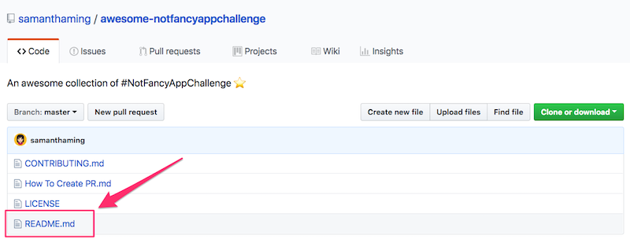
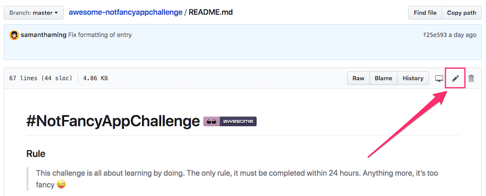
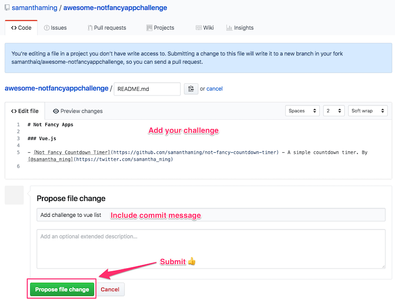

# How to Add Your Challenge

To add your challenge(s) to the list, you will need to create a Pull Request.

---

### Step 1: Click on the `readme.md` file

### Step 2: Click on the edit icon

### Step 3: Add your challenge

You can add your challenge directly to the readme file. Please make sure you follow the [Contributing](CONTRIBUTING.md) formatting guideline.

